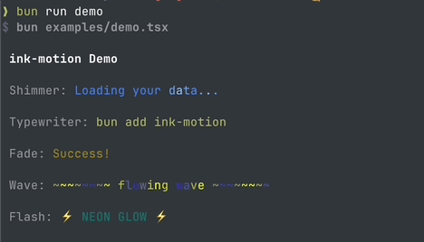

# ink-motion

Animation components for Ink CLIs: shimmer, typewriter, fade, wave, flash.

[](https://github.com/JR-G/ink-motion/actions/workflows/ci.yml)
[](https://www.npmjs.com/package/ink-motion)
[](https://www.npmjs.com/package/ink-motion)
[](./LICENSE)



## Why ink-motion

- Drop-in animated text for Ink without hand-rolled timers.
- Consistent timing controls across effects (speed, enabled, onComplete).
- TypeScript-first API with strict types.
- Tiny dependency surface: just Ink + React + Chalk.

## Installation

```bash
bun add ink-motion
npm install ink-motion
pnpm add ink-motion
```

## Quick Start

```tsx
import { render } from 'ink'
import { Shimmer, Typewriter } from 'ink-motion'

function App() {
  return (
    <>
      <Shimmer colors={['#60a5fa', '#3b82f6', '#60a5fa']}>
        Loading...
      </Shimmer>

      <Typewriter speed={2} cursor="█">
        bun add ink-motion
      </Typewriter>
    </>
  )
}

render(<App />)
```

## Components

- **Shimmer** — moving highlight band across text
- **Typewriter** — character-by-character reveal with cursor
- **Fade** — smooth fade in/out with easing
- **Wave** — sine wave brightness or vertical shift
- **Flash** — pulsing neon-like glow

## Demo

```bash
git clone https://github.com/JR-G/ink-motion
cd ink-motion
bun install
bun run demo
```

## Documentation

- Guide: `docs/guide.md`

## Requirements

- Ink `^5`
- React `^18`

## Development

Bun is used for local scripts and tests.

```bash
bun install
bun run lint
bun run test
bun run build
```

## License

MIT
